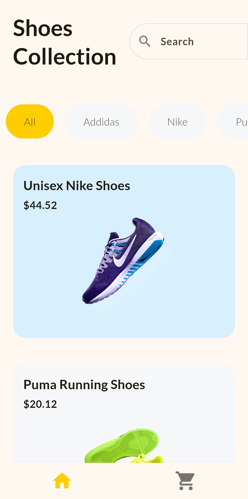
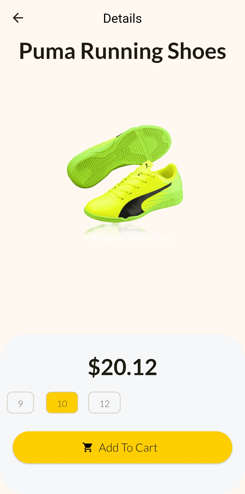
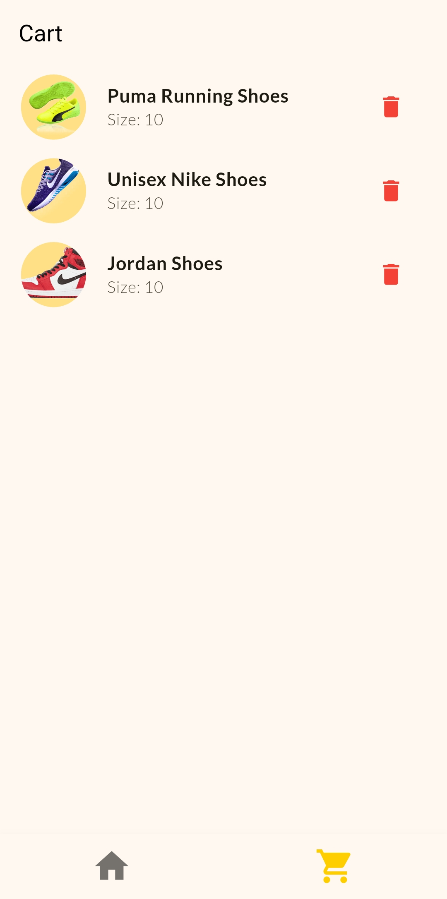

# shopping_app

A new Flutter project.

## Getting Started

This project is a starting point for a Flutter application.

A few resources to get you started if this is your first Flutter project:

- [Lab: Write your first Flutter app](https://docs.flutter.dev/get-started/codelab)
- [Cookbook: Useful Flutter samples](https://docs.flutter.dev/cookbook)

For help getting started with Flutter development, view the
[online documentation](https://docs.flutter.dev/), which offers tutorials,
samples, guidance on mobile development, and a full API reference.

# 🛒 Shopping App (Flutter)

A modern shopping UI built using Flutter with Provider for state management.
This app demonstrates product browsing, cart functionality, and clean UI design.

---

## ✨ Features

* Product listing with category filters
* Search bar UI
* Product details with size selection
* Add to cart functionality
* Cart screen with remove option
* Delete confirmation dialog
* Bottom navigation (Home & Cart)

---

## 🧠 State Management

* Provider (ChangeNotifier)
* Reactive cart updates

---

## 🛠 Tech Stack

* Flutter
* Dart
* Provider

---

## 📱 Screenshots

---

## ▶️ How to Run

flutter pub get
flutter run

---

## 👨‍💻 Author

Benhur

  
  
  
  

